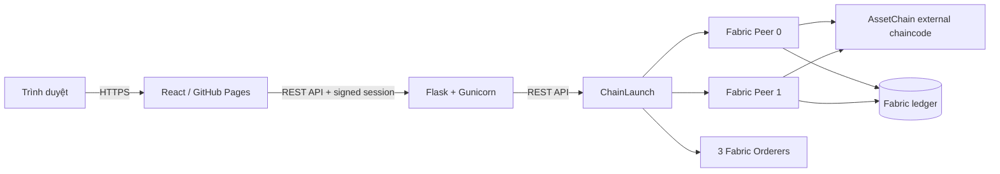

# AssetChain

AssetChain là hệ thống quản lý vòng đời tài sản trên **Hyperledger Fabric**. Hệ thống cung cấp giao diện web theo vai trò, API bảo mật và chaincode lưu trạng thái cùng lịch sử giao dịch bất biến của tài sản.

- Frontend production: <https://canhhtungg.github.io/assetchain/>
- Backend health: <https://ubuntu-fabric.tail3949da.ts.net/api/health>
- Mã nguồn: <https://github.com/canhhtungg/assetchain>

## Mục lục

- [Tính năng](#tính-năng)
- [Kiến trúc](#kiến-trúc)
- [Cấu trúc mã nguồn](#cấu-trúc-mã-nguồn)
- [Yêu cầu hệ thống](#yêu-cầu-hệ-thống)
- [Cài đặt ChainLaunch](#cài-đặt-chainlaunch)
- [Tạo mạng Fabric cho AssetChain](#tạo-mạng-fabric-cho-assetchain)
- [Build và triển khai chaincode](#build-và-triển-khai-chaincode)
- [Cài đặt backend](#cài-đặt-backend)
- [Cài đặt frontend](#cài-đặt-frontend)
- [Kiểm thử](#kiểm-thử)
- [Vận hành và giám sát](#vận-hành-và-giám-sát)
- [Bảo mật và sao lưu](#bảo-mật-và-sao-lưu)
- [Xử lý sự cố](#xử-lý-sự-cố)

## Tính năng

### Quản lý tài sản

- Tạo, cập nhật, chuyển quyền sở hữu, bán lại và xóa tài sản.
- Phân loại tài sản, quản lý số lượng, giá trị, trạng thái và chủ sở hữu.
- Lưu lịch sử Create, Update, Transfer và Delete trên ledger.
- Dùng tombstone cho tài sản đã xóa để lịch sử vẫn truy xuất được.
- Khách hàng chỉ xem lịch sử kể từ lần gần nhất họ nhận quyền sở hữu.

### Người dùng và phân quyền

Hệ thống có năm vai trò:

| Vai trò | Phạm vi chính |
|---|---|
| Admin | Toàn quyền, quản lý người dùng, phân quyền và hệ thống |
| Quản lý | Theo dõi tài sản, nhân sự và lịch sử theo quyền được cấp |
| Nhân viên bán hàng | Quản lý khách hàng và chuyển tài sản từ kho cho khách hàng |
| Nhân viên kho | Tạo và cập nhật hàng hóa trong kho |
| Khách hàng | Xem tài sản của mình, cập nhật liên hệ và bán lại/xóa theo quyền |

Admin có thể thay đổi ma trận quyền tại trang **Phân quyền**. Quyền truy cập menu và API đều được kiểm tra ở backend; frontend chỉ dùng ma trận quyền để điều chỉnh trải nghiệm hiển thị.

### Xác thực và bảo mật

- Phiên đăng nhập được ký bởi backend và lưu trong cookie `HttpOnly`, `Secure`, `SameSite`; CSRF token riêng chỉ giữ trong `sessionStorage`.
- Mutating request dùng `Idempotency-Key`; backend lưu kết quả thành công trong SQLite dùng chung giữa các Gunicorn worker.
- Bắt buộc đổi mật khẩu trong lần đăng nhập đầu tiên hoặc sau khi Admin đặt lại mật khẩu.
- Mật khẩu đang dùng trong luồng đổi mật khẩu lần đầu chỉ tồn tại trong React state/RAM.
- Chính sách mật khẩu, rate limit đăng nhập và yêu cầu đặt lại mật khẩu.
- HTTP security headers, CSP, giới hạn payload và request ID.
- Audit log JSON có che dữ liệu nhạy cảm, phù hợp truy vấn bằng journald.
- Systemd credentials cho thông tin đăng nhập ChainLaunch và khóa ký phiên.
- Mỗi user có ChainLaunch client signing key riêng; mutation fail-closed nếu
  registry local hoặc binding MSP/certificate trên ledger chưa hợp lệ.
- Query có thể dùng service identity, nhưng service key không được fallback cho
  mutation và `actorID` luôn phải khớp certificate invoker.

## Kiến trúc



Luồng chính:

1. Người dùng đăng nhập qua Flask API.
2. Backend xác thực người dùng bằng dữ liệu hash trên Fabric hoặc kho credential tương thích cho tài khoản cũ.
3. Backend đăng nhập ChainLaunch bằng credential chỉ có trên máy chủ.
4. ChainLaunch gửi query/invoke tới Fabric và external chaincode.
5. Frontend nhận dữ liệu nghiệp vụ đã được lọc theo vai trò và quyền.

## Cấu trúc mã nguồn

```text
.
├── assetcc/
│   ├── app.py                    # Flask API, xác thực, RBAC và audit log
│   ├── chaincode.go              # Smart contract AssetChain
│   ├── main.go                   # Fabric external chaincode server
│   ├── Dockerfile                # Image chaincode
│   ├── test_app.py               # Backend tests
│   ├── chaincode_test.go         # Chaincode tests
│   ├── manage_credentials.py     # Tạo hash cho tài khoản cũ
│   ├── .env.example              # Danh sách cấu hình mẫu, không chứa bí mật
│   └── systemd/                  # Drop-in credentials và hardening
├── frontend/
│   ├── src/                      # React application
│   ├── public/                   # Logo và favicon
│   ├── vite.config.js            # Base path, CSP production
│   └── package.json
└── README.md
```

Các file runtime như `.env`, credential, state xác thực, ma trận quyền, certificate, private key, `network-config.yaml`, `dist/` và `report/` không được đưa vào Git.

## Yêu cầu hệ thống

### Máy chạy ChainLaunch/Fabric

Theo tài liệu ChainLaunch:

- Ubuntu 22.04 trở lên; Ubuntu 24.04 LTS được khuyến nghị.
- Tối thiểu 2 CPU, 4 GB RAM và 10 GB đĩa.
- Khuyến nghị 4 CPU trở lên, 8 GB RAM trở lên và 20 GB đĩa trở lên.
- Docker 20.10 trở lên; nên dùng phiên bản ổn định mới nhất.

### Công cụ phát triển AssetChain

- Git.
- Go theo phiên bản trong `assetcc/go.mod`.
- Python 3 và `venv`.
- Node.js tương thích Vite 8; dự án production hiện dùng Node.js 24.
- npm.
- Docker nếu build/push image chaincode.

Clone dự án:

```bash
git clone https://github.com/canhhtungg/assetchain.git fabric-project
cd fabric-project
```

## Cài đặt ChainLaunch

ChainLaunch là lớp quản trị mạng Fabric, node, channel và vòng đời chaincode mà backend AssetChain gọi qua REST API.

### Cách khuyến nghị: installer chính thức

Tải script chính thức về để kiểm tra trước khi chạy:

```bash
curl -fsSL https://chainlaunch.dev/deploy.sh -o /tmp/chainlaunch-deploy.sh
less /tmp/chainlaunch-deploy.sh
bash /tmp/chainlaunch-deploy.sh
```

Installer sẽ:

- Phát hiện hệ điều hành và kiến trúc CPU.
- Cài Docker nếu máy chưa có.
- Tải ChainLaunch mới nhất.
- Tạo tài khoản Admin ban đầu với mật khẩu ngẫu nhiên.
- Đăng ký ChainLaunch thành service trên Linux/macOS.
- Lưu credential cục bộ trong `~/.chainlaunch/credentials.txt` với quyền `0600`.

Không đưa file credential, cơ sở dữ liệu hoặc thư mục `~/.chainlaunch/` vào Git; không gửi credential qua chat, issue hay log. Sau khi cài, mở <http://localhost:8100> và đăng nhập bằng thông tin được installer cung cấp trên chính máy chủ.

Xác minh:

```bash
chainlaunch version
curl -fsS http://127.0.0.1:8100/swagger/index.html >/dev/null
```

Nếu binary được installer đặt tại `~/.chainlaunch/bin/chainlaunch` nhưng chưa có trong `PATH`, dùng đường dẫn đầy đủ hoặc thêm thư mục đó vào `PATH` theo cách quản trị shell của máy.

### Cài thủ công

Bản binary theo hệ điều hành/kiến trúc có tại trang release của dự án:

<https://github.com/LF-Decentralized-Trust-labs/chaindeploy/releases>

ChainLaunch cần tài khoản Admin khi khởi động lần đầu, SQLite database, data directory và Docker. Cài thủ công cũng cần tự cấu hình systemd/launchd. Xem hướng dẫn cập nhật tại:

- <https://docs.chainlaunch.dev/getting-started>
- <https://docs.chainlaunch.dev/cli-reference>

Ưu tiên installer chính thức để tránh sai khác về service, thư mục dữ liệu và quyền file giữa các phiên bản.

## Tạo mạng Fabric cho AssetChain

Topology tham chiếu của AssetChain:

| Thành phần | Giá trị |
|---|---|
| Organization MSP | `Org1MSP` |
| Channel | `assetchannel` |
| Peers | 2 |
| Orderers | 3 |
| Chaincode | `assetcc` |
| Endorsement policy | `OR('Org1MSP.peer')` |
| External chaincode address | `127.0.0.1:9999` |

Có thể tạo mạng test bằng CLI:

```bash
chainlaunch testnet fabric \
  --name assetchain-network \
  --org "Org1MSP" \
  --peerOrgs "Org1MSP" \
  --ordererOrgs "Org1MSP" \
  --channels assetchannel \
  --peerCounts "Org1MSP=2" \
  --ordererCounts "Org1MSP=3"
```

Hoặc dùng Web UI tại `http://localhost:8100` để tạo organization, peer, orderer, network và channel. Sau khi tạo, kiểm tra:

- Hai peer ở trạng thái running và đã join `assetchannel`.
- Ba orderer hoạt động và channel có quorum.
- ChainLaunch Swagger mở được tại `/swagger/index.html`.
- ID của chaincode và signing key đã được ghi nhận để cấu hình backend.

> `network-config.yaml` được export từ Fabric có thể chứa certificate và private key. File này chỉ dùng cục bộ, phải có quyền truy cập hạn chế và tuyệt đối không commit.

## Build và triển khai chaincode

AssetChain chạy theo mô hình **Fabric external chaincode**.

### 1. Kiểm thử và build image

```bash
cd assetcc
go test ./...
docker build -t registry.example.com/your-team/assetcc:VERSION .
docker push registry.example.com/your-team/assetcc:VERSION
cd ..
```

Thay registry, namespace và `VERSION` bằng image/version thực tế. Không tái sử dụng tag đã phát hành; mỗi lần nâng cấp phải dùng version mới.

### 2. Tạo chaincode/definition trong ChainLaunch

Trong ChainLaunch Web UI:

1. Tạo chaincode tên `assetcc` trên channel `assetchannel` nếu chưa có.
2. Tạo definition mới với image vừa push.
3. Dùng version mới và tăng `sequence` so với definition đã commit.
4. Gắn `assetcc/collections_config.json` vào definition để collection `userCredentials` tồn tại trước khi chaincode ghi/đọc credential.
5. Giữ policy `OR('Org1MSP.peer')` chỉ cho môi trường một organization. Production consortium phải thêm MSP độc lập và dùng policy như `AND('Org1MSP.peer','Org2MSP.peer')` sau khi hai tổ chức đã join channel và approve definition.
6. Đặt chaincode address là `127.0.0.1:9999` nếu ChainLaunch và container cùng host như topology tham chiếu.
7. Chạy lần lượt **Deploy → Install → Approve → Commit**.

Sau lần deploy đầu tiên có PDC, gọi `MigrateUserCredential` một lần cho từng username cũ. Hàm này chép hash từ world state sang collection `userCredentials` rồi xóa key `AUTH_*` khỏi trạng thái hiện hành. Sao lưu ledger trước khi migrate và xác minh `GetPasswordHash` vẫn hoạt động. Credential mới và lần đổi mật khẩu tiếp theo chỉ ghi vào PDC.

> Fabric là bất biến: xóa world state **không xóa hash khỏi block/history cũ**. Sau migration phải buộc toàn bộ tài khoản đổi mật khẩu. Nếu yêu cầu bảo mật bắt buộc loại bỏ dữ liệu lịch sử, cần tạo channel/ledger mới và migrate dữ liệu nghiệp vụ đã làm sạch.

Trước bước Commit của một bản nâng cấp, query các hàm đọc trên ledger hiện tại để phát hiện lỗi tương thích dữ liệu cũ. Tối thiểu kiểm tra `GetAllAssets` và `GetAllAssetRecords`. Nếu lỗi, redeploy definition đang hoạt động trước đó rồi sửa bằng một image/version/sequence mới.

Sau khi commit, xác minh trên **mọi peer**:

- Tên chaincode là `assetcc`.
- Version và sequence giống definition mới.
- Container image đang running.
- `GetAllAssets` và `GetAllAssetRecords` trả kết quả.

Production được xác minh ngày 2026-10-01 dùng image `docker.io/canhtung/assetcc:6.0.0` (digest `sha256:d2cbe05fc8fa41164a5a61f7fbe1e072926edc1ec7eee5c6d81e20f52022c247`), version `6.0.0`, sequence `9` trên hai peer. Tám tài khoản đăng nhập hiện có đã được bind với tám Fabric client certificate riêng; `STORE` là tài khoản hệ thống không đăng nhập. Đây là thông tin tham chiếu; hãy đọc trạng thái ChainLaunch hiện tại trước mỗi lần nâng cấp.

## Cài đặt backend

### 1. Tạo môi trường Python

```bash
cd assetcc
python3 -m venv venv
./venv/bin/python -m pip install --upgrade pip
./venv/bin/pip install -r requirements.txt
cp .env.example .env
```

Mở `.env` bằng editor cục bộ và cấu hình các giá trị không bí mật. `.env` đã được ignore và không được commit.

Các biến quan trọng:

| Biến | Ý nghĩa |
|---|---|
| `FABRIC_HOST` | REST API ChainLaunch, thường là `http://127.0.0.1:8100/api/v1` |
| `FABRIC_USERNAME` | Tài khoản service ChainLaunch; nên cấp qua systemd credential |
| `FABRIC_PASSWORD` | Mật khẩu ChainLaunch; nên cấp qua systemd credential |
| `FABRIC_CHAINCODE_ID` | ID chaincode trong ChainLaunch |
| `FABRIC_KEY_ID` | Service key chỉ dùng query/read; không dùng cho mutation user |
| `IDENTITY_REGISTRY_DB` | SQLite local mode `0600`: userID → key ID/MSP/certificate fingerprint và hàng đợi yêu cầu cấp identity |
| `FABRIC_IDENTITY_ORGANIZATION_ID` | Organization ChainLaunch dùng khi Admin duyệt yêu cầu cấp identity; production hiện dùng `1` |
| `APP_SECRET` | Khóa ngẫu nhiên dùng ký phiên; nên cấp qua systemd credential |
| `AUTH_TOKEN_MAX_AGE` | Thời hạn phiên, mặc định 8 giờ |
| `ADMIN_OWNER_ID` | ID Admin/chủ kho mặc định, production dùng `U001` |
| `CORS_ORIGINS` | Danh sách origin frontend được phép gọi API |
| `AUTH_CREDENTIALS_FILE` | File hash credential cho tài khoản cũ, nếu cần |
| `ROLE_PERMISSIONS_FILE` | State ma trận quyền cục bộ |
| `AUTH_STATE_FILE` | State xác thực/reset cục bộ |
| `DEFAULT_INITIAL_PASSWORD` | Mật khẩu tạm do Admin cấp; người dùng phải đổi ngay |
| `BACKEND_HOST` | Host bind Flask, mặc định `127.0.0.1` |
| `MAX_REQUEST_BYTES` | Giới hạn request body, mặc định 64 KiB |
| `AUTH_COOKIE_*` | Tên/cờ bảo mật cookie phiên; production cross-site dùng `Secure=1`, `SameSite=None` |
| `AUTH_RETURN_BEARER_TOKEN` | Cờ tương thích frontend cũ; đặt `0` ngay sau khi frontend cookie-session đã phát hành |
| `SECURITY_STATE_DB` | SQLite dùng chung cho rate limit và idempotency trên một host |
| `IDEMPOTENCY_TTL` | Thời gian giữ kết quả idempotency, mặc định 24 giờ |

Ba biến `IDENTITY_BOOTSTRAP_USER_ID`, `IDENTITY_BOOTSTRAP_MSP_ID` và
`IDENTITY_BOOTSTRAP_CERT_FINGERPRINT` chỉ thuộc runtime external chaincode.
Chúng để trống theo mặc định và chỉ được đặt giống nhau trên mọi peer trong cửa
sổ bootstrap Admin một lần; không phải secret nhưng là policy nhạy cảm.

Không đặt secret trong Git, command line, URL hoặc unit file có thể đọc công khai.

### 2. Chạy development

```bash
./venv/bin/python app.py
```

Kiểm tra:

```bash
curl -fsS http://127.0.0.1:5000/api/health
```

### 3. Chạy production bằng systemd user service

Tạo thư mục credential chỉ chủ tài khoản được truy cập, sau đó tạo riêng ba file `FABRIC_USERNAME`, `FABRIC_PASSWORD` và `APP_SECRET` bằng editor hoặc secret-management workflow của máy chủ. Mỗi file chỉ chứa giá trị tương ứng, không có dấu nháy hay tên biến.

```bash
mkdir -p ~/.config/assetchain/credentials
chmod 700 ~/.config/assetchain/credentials
chmod 600 ~/.config/assetchain/credentials/FABRIC_USERNAME
chmod 600 ~/.config/assetchain/credentials/FABRIC_PASSWORD
chmod 600 ~/.config/assetchain/credentials/APP_SECRET
```

`APP_SECRET` phải là giá trị ngẫu nhiên mạnh, ổn định giữa các lần restart. Thay đổi giá trị này sẽ làm mất hiệu lực tất cả phiên đang đăng nhập.

Trên host hỗ trợ `systemd-creds`, ưu tiên tạo credential mã hóa at-rest và dùng mẫu `assetcc/systemd/credentials-encrypted.conf.example`. Không commit file `.cred`; việc tạo/rotate phải thực hiện trực tiếp trên host qua quy trình quản trị bí mật.

Service tham chiếu:

```ini
# ~/.config/systemd/user/assetchain-backend.service
[Unit]
Description=AssetChain Flask backend
After=network-online.target
Wants=network-online.target

[Service]
Type=simple
WorkingDirectory=%h/fabric-project/assetcc
ExecStart=%h/fabric-project/assetcc/venv/bin/gunicorn --workers 1 --threads 4 --bind 127.0.0.1:5000 --access-logfile - --error-logfile - app:app
Restart=on-failure
RestartSec=3
Environment=PYTHONUNBUFFERED=1

[Install]
WantedBy=default.target
```

Nếu service đã tồn tại, đọc và hợp nhất cấu hình hiện tại thay vì ghi đè. Copy hai drop-in đã kiểm soát phiên bản:

```bash
mkdir -p ~/.config/systemd/user/assetchain-backend.service.d
cp systemd/credentials.conf ~/.config/systemd/user/assetchain-backend.service.d/credentials.conf
cp systemd/hardening.conf ~/.config/systemd/user/assetchain-backend.service.d/hardening.conf
systemctl --user daemon-reload
systemctl --user enable --now assetchain-backend.service
```

Nếu repository không nằm tại `%h/fabric-project`, cập nhật `WorkingDirectory`, `ExecStart` và `ReadWritePaths` trong hardening drop-in trước khi khởi động.

Xác minh:

```bash
systemctl --user is-active assetchain-backend.service
curl -fsS http://127.0.0.1:5000/api/health
journalctl --user -u assetchain-backend.service -n 100 --no-pager
```

Để service user tự chạy sau reboot khi người dùng chưa đăng nhập, quản trị viên máy chủ có thể bật linger cho tài khoản triển khai.

## Cài đặt frontend

### Development

```bash
cd frontend
npm ci
npm run dev
```

Frontend development mặc định gọi backend tại `http://127.0.0.1:5000`. Có thể đặt `VITE_API_URL` trong file env cục bộ của Vite để dùng backend khác; không thêm secret vào biến frontend vì mọi giá trị Vite đều được đóng gói vào bundle công khai.

### Build production

```bash
npm run lint
npm run build
npm run preview
```

Output nằm trong `frontend/dist/`. Cấu hình Vite dùng base path `/assetchain/`, phù hợp repository GitHub Pages hiện tại. Khi dùng domain/path khác, cập nhật `base`, CSP `connect-src`, backend `CORS_ORIGINS` và `VITE_API_URL` cùng lúc.

### GitHub Pages

Repository production phục vụ nội dung branch `gh-pages` từ thư mục gốc. Quy trình phát hành:

1. Chạy lint và build.
2. Đưa **nội dung bên trong** `frontend/dist/` lên branch `gh-pages`.
3. Giữ file `.nojekyll`.
4. Không đưa source secret hoặc `report/` vào branch Pages.
5. Xác minh `index.html`, bundle JS/CSS và API health sau khi Pages cập nhật.

## Kiểm thử

Chạy trước mọi lần commit/deploy:

```bash
cd assetcc
go test ./...
./venv/bin/python -m unittest -v test_app.py

cd ../frontend
npm run lint
npm run build
```

Kiểm tra dependency khi các công cụ đã được cài:

```bash
(cd assetcc && govulncheck ./...)
pip-audit -r assetcc/requirements.txt
npm --prefix frontend audit --omit=dev --audit-level=high
```

Ngoài unit test, một bản nâng cấp chaincode chỉ hoàn tất khi đã kiểm tra query thật qua ChainLaunch và mọi peer cùng báo version/sequence mới.

## Vận hành và giám sát

### Health check

```bash
curl -fsS http://127.0.0.1:5000/api/health
systemctl --user is-active assetchain-backend.service
docker ps --filter name=assetcc
```

### Log backend và audit

```bash
journalctl --user -u assetchain-backend.service -f
journalctl --user -u assetchain-backend.service --since today -o cat | grep '^AUDIT '
```

Mỗi audit event có timestamp, event, outcome, actor, target, request ID, client IP và chi tiết đã được redact. Dùng `X-Request-ID` để nối lỗi API với audit log.

### ChainLaunch

- Dashboard và Swagger mặc định: `http://127.0.0.1:8100` và `/swagger/index.html`.
- Kiểm tra node, channel, container chaincode và timeline lifecycle từ Web UI.
- Dùng `chainlaunch version` và `chainlaunch --help` để kiểm tra CLI thực tế vì cờ có thể thay đổi giữa các phiên bản.

## Bảo mật và sao lưu

- Chỉ publish Flask qua HTTPS reverse proxy/Tailscale; Gunicorn mặc định chỉ bind loopback.
- Không expose trực tiếp peer, orderer, Docker socket hoặc ChainLaunch Admin UI ra Internet.
- Không commit `.env`, credential, certificate, private key, database, auth state, permission state, `network-config.yaml` hoặc `report/`.
- Không ghi mật khẩu/token vào command line, URL, log, issue hoặc tài liệu.
- Đặt quyền `0700` cho thư mục credential và `0600` cho file secret/state.
- Sao lưu có kiểm soát thư mục dữ liệu và SQLite database của ChainLaunch sau khi bảo đảm snapshot nhất quán.
- Sao lưu các file `role-permissions.local.json`, `auth-state.local.json`, `identity-registry.local.sqlite3` và credential hash nếu production đang dùng chúng.
- Mã hóa bản sao lưu, giới hạn quyền truy cập và diễn tập restore định kỳ.
- Dùng version image bất biến; ghi nhận digest Docker khi phát hành.
- Luôn giữ definition đang hoạt động trước đó để rollback khi pre-commit compatibility check thất bại.


> **PDC rollout gate:** `USER_CREDENTIAL_PDC_ENABLED` must remain `false` until the committed Fabric definition actually contains `collections_config.json`. The current ChainLaunch definition API commits `Collections: nil`; enabling the flag earlier would break credential reads. Identity migration can be deployed independently, then PDC can be enabled in a later lifecycle upgrade that proves collection bytes on-chain.

### Hardening đã triển khai và phạm vi còn lại

Các kiểm soát có thể chứng minh bằng source/test trong repository:

- Cookie phiên `HttpOnly` thay cho bearer token trong `localStorage`; mọi mutation qua cookie phải có `X-CSRF-Token`.
- `Idempotency-Key` cho các hàm chaincode ghi; kết quả thành công được replay thay vì gửi lại giao dịch.
- Rate limit đăng nhập/reset dùng SQLite khi `SECURITY_STATE_DB` được cấu hình, nên nhiều Gunicorn worker trên cùng host dùng chung trạng thái.
- Password hash mới nằm trong Fabric PDC `userCredentials`; có hàm migrate dữ liệu `AUTH_*` cũ khỏi world state hiện hành.
- Hai `network-config.yaml` có private-key marker đã được bỏ khỏi Git index nhưng vẫn được giữ cục bộ nhờ `.gitignore`.
- Dependency Python khóa version; audit JSON có request ID và redact dữ liệu nhạy cảm.
- Mutation dùng ChainLaunch client key riêng theo user từ registry local; chaincode đối chiếu `actorID` với MSPID và SHA-256 fingerprint của certificate invoker.
- Service key chỉ dùng query. User chưa có binding active bị fail-closed; không có fallback/bypass mặc định.
- Provisioning chỉ nhận/trả metadata công khai, không nhập hoặc xuất private key. Bootstrap Admin là quy trình hai bước, allowlist chính xác và one-time marker trên ledger.

### Threat model của identity layer

- **Backend bị lỗi gán actor:** chaincode vẫn từ chối vì actor binding không khớp certificate ký proposal.
- **Service/query key bị lạm dụng:** key không có binding user nên mọi business mutation bị từ chối.
- **User mạo danh user khác:** cả backend kiểm actor với session và chaincode kiểm actor với MSP/certificate.
- **Registry local bị sửa:** sửa `key_id` đơn lẻ không đủ vì ledger binding vẫn kiểm certificate; tuy vậy attacker kiểm soát cả backend host và ChainLaunch Admin vẫn nằm ngoài trust boundary, nên cần hardening/audit/backup host.
- **Replay/retry:** idempotency giảm giao dịch lặp từ API; Fabric validation/MVCC vẫn là lớp quyết định ledger.
- **Provisioning dở dang:** key có thể đã được ChainLaunch tạo nhưng binding ledger thất bại; trạng thái giữ pending/failed và không được dùng mutation, không tự xóa key.
- **Bootstrap takeover:** bootstrap tắt mặc định, yêu cầu exact Admin ID + MSPID + fingerprint trên mọi peer, chỉ chấp nhận user ledger role Admin và chỉ chạy một lần.
- **Private-key exposure:** AssetChain chỉ chuyển `key_id`; private key nằm trong trust boundary của ChainLaunch và không được ghi registry/log/API response.

Những phần **không thể được coi là đã khắc phục chỉ bằng commit này**:
- Network hiện chỉ có `Org1MSP`. Multi-MSP endorsement chỉ có hiệu lực sau khi có tổ chức/peer độc lập, cập nhật channel, approve và commit definition từ mỗi org.
- Hash cũ vẫn tồn tại trong lịch sử ledger bất biến; migration phải đi kèm reset password toàn bộ, hoặc channel mới nếu phải loại bỏ lịch sử.
- `network-config.yaml` từng xuất hiện trong Git history; certificate/private key liên quan phải được rotate/revoke và lịch sử remote phải được làm sạch bằng quy trình phối hợp, không chỉ bằng commit xóa file.
- Contact và dữ liệu tài sản vẫn ở world state; cần thiết kế collection theo consortium/quyền truy cập và kế hoạch migration riêng trước khi chuyển.
- SQLite giải quyết nhiều worker trên **một host**, không phải HA đa host. Multi-host cần Redis/PostgreSQL dùng chung, load balancer có health check, và state/session strategy đã kiểm thử.
- SIEM cần collector và đích lưu trữ bên ngoài; repository chỉ phát audit JSON. Cần alert rule, retention, quyền truy cập và diễn tập sự cố.
- Offsite backup/restore chưa được chứng minh cho đến khi có bản sao mã hóa ngoài host, RPO/RTO, log drill và biên bản restore thực tế.
- HSM phụ thuộc key provider của Fabric/ChainLaunch và phần cứng/KMS thực tế; không thể chứng minh bằng unit test.
- Quy trình phê duyệt điều chuyển/bảo trì/thanh lý chuyên biệt cần mô hình nghiệp vụ và phân tách nhiệm vụ được duyệt; hiện mutation vẫn thực hiện trực tiếp theo RBAC.

## Xử lý sự cố

### Backend báo không kết nối được ChainLaunch

1. Kiểm tra ChainLaunch/service đang chạy và port 8100 đang listen.
2. Kiểm tra `FABRIC_HOST` có hậu tố `/api/v1`.
3. Kiểm tra systemd đã nạp ba credential file và restart backend sau khi thay đổi.
4. Xem `journalctl` nhưng không in nội dung credential.

### Đăng nhập ChainLaunch thất bại

- Xác minh tài khoản service còn hoạt động trong ChainLaunch.
- Cập nhật credential qua cơ chế secret của host, không đặt giá trị vào lệnh hoặc Git.
- Restart backend để systemd tạo lại runtime credential directory.

### Chaincode invoke/query lỗi sau nâng cấp

- So sánh version và sequence trên từng peer.
- Kiểm tra container external chaincode và address `127.0.0.1:9999`.
- Đọc timeline Deploy/Install/Approve/Commit trong ChainLaunch.
- Query cả `GetAllAssets` và `GetAllAssetRecords` để phát hiện lỗi tương thích schema cũ.
- Nếu definition chưa commit và query lỗi, redeploy definition ổn định trước đó rồi phát hành image/version/sequence mới.

### Frontend báo Fabric Offline

- Gọi `/api/health` trước.
- Kiểm tra CSP `connect-src`, `VITE_API_URL` và `CORS_ORIGINS`.
- Xóa phiên cũ bằng nút đăng xuất rồi đăng nhập lại nếu token đã hết hạn hoặc bị thu hồi.
- Kiểm tra backend có gọi được ChainLaunch và chaincode read API hay không.

## Tài liệu tham khảo

- ChainLaunch: <https://docs.chainlaunch.dev/>
- ChainLaunch Quick Start: <https://docs.chainlaunch.dev/getting-started>
- ChainLaunch CLI: <https://docs.chainlaunch.dev/cli-reference>
- Hyperledger Fabric: <https://hyperledger-fabric.readthedocs.io/>
- React: <https://react.dev/>
- Vite: <https://vite.dev/>
